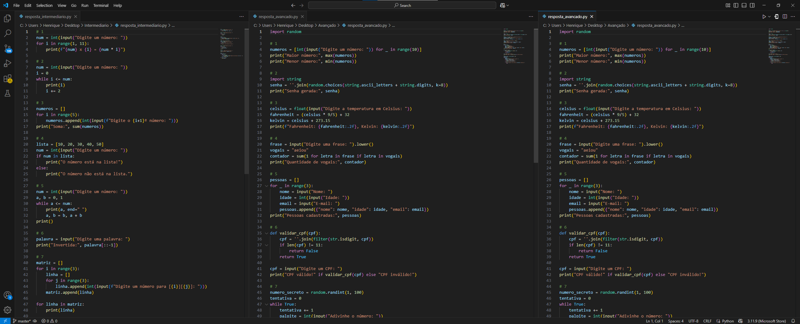

Bora estudar! 

Conteúdo do repositório.

Pedi para o GPT gerar 7 questões com 5 níveis diferentes, sendo eles:

🔰 Iniciante: Introdução à sintaxe básica, entrada e saída de dados, e pequenos ajustes em códigos simples.

💬 Básico: Escrita de código do zero, operações matemáticas, entrada de dados e manipulação de variáveis.

🥉 Mediano: Uso de if, else e criação de menus interativos para decisões lógicas.

🥈 Intermediário: Estruturas de repetição (for, while), manipulação de listas e matrizes.

🥇 Avançado: Aplicação de todo o conteúdo anterior com desafios mais complexos, como validações, geração de senhas e jogos interativos.
